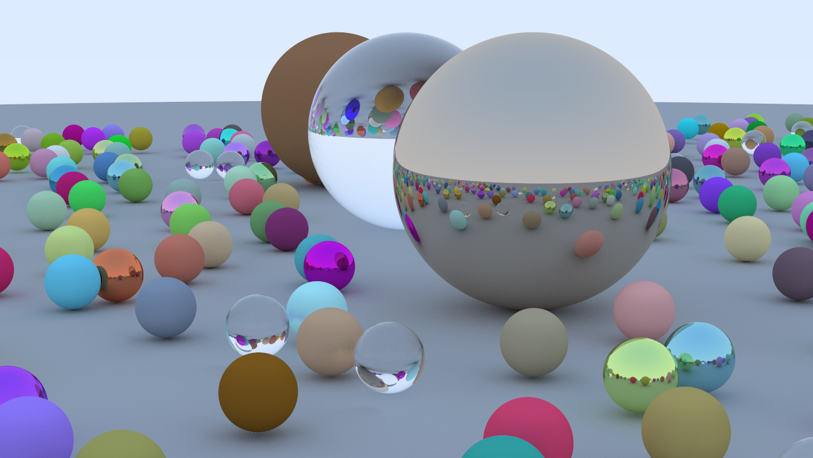

# AIRIS

AIRIS is a project for learning about and implementing computer graphics effects and techniques among some other cool stuff. 

#### Graphics APIs

Learning DirectX 12 API and hoping to implement some cool stuff. 

## Branches

### <u>main</u>

This is the main branch where the raster renderer will be implemented, at this tiem it has nothing to show other than a single triangle. :)

### <u>compute-rtiaw</u>

A compute shader implmenetation of the first book from the ***Ray Tracing In A Weekend*** Series by Peter Shirley, Trevor David Black, and Steve Hollasch.  
- Only sphere intersections for now
- Able to move Camera's position and fov in real time
- Accumulates frames over time, and any changes in the camera resets the accumulation
- 8ms per frame sample on a RTX3060 for a scene with 100 spheres (No acceleration structure yet ;( )

### Showcase

##### 512 Samples | 7 Bounces

## Build

Currently this repo is only a place for me to save my progress, but as the project grows I plan on adding a build system, such as premake or cmake. This project also started while I was learning Win32 API and DirectX so I don't plan adding support for other os' or platforms.  
Although there isn't a build system, I have included the VS Solution and Project files, in case there's a cat w/ Windows 10/11 interested in compiling **this**.

## References and Acknowledgements

#### List of Books, Repositories, Open Source Libraries, and other resources that helped me:
- [Ray Tracing In A Weekend](https://raytracing.github.io/books/RayTracingInOneWeekend.html)
- [3D Game Programming with DirectX 12 Book by Frank D. Luna](https://www.amazon.com/Introduction-3D-Game-Programming-DirectX/dp/1942270062)
- [Direct3D 12 programming guide from MSDN](https://learn.microsoft.com/en-us/windows/win32/direct3d12/directx-12-programming-guide)
- [Unreal Engine](https://github.com/EpicGames/UnrealEngine)
- [Kaguya Engine](https://github.com/kcloudy0717/Kaguya)  

#### <u>Dependencies:</u>

- [spdlog](https://github.com/gabime/spdlog)
- [glm](https://github.com/g-truc/glm)